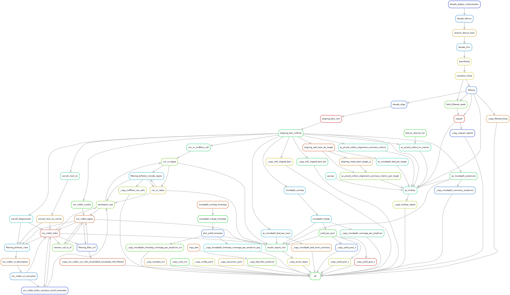

#  neville_mx_amplicon

#### A pipeline to filter, align, and analyze Nanopore sequence data from pooled amplicons

ps://github.com/hydra-genetics/neville_mx_amplicon/actions/workflows/lint.yaml/badge.svg?branch=devhttps://github.com/clinical-genomics-uppsala/neville_mx_amplicon/blob/main/.github/workflows/lint.yaml)


[](https://opensource.org/licenses/gpl-3.0.html)

***

## :speech_balloon: Introduction

This pipeline implements a workflow with Snakemake for the analysis of Oxford Nanopore Technologies (ONT) sequence data 
from pooled amplicons at Clinical Genomics Uppsala (CGU) in view of supporting 
the rapid diagnostics of Acute Myeloid Leukemia (AML).

The pipeline is partly build upon the tools and modules available in [hydra-genetics](https://github.com/hydra-genetics).
The steps that are specific to the analysis of pooled amplicons are implemented in this repository,
as well as the features that depend on the software [Dorado](https://github.com/nanoporetech/dorado) 
([documentation](https://dorado-docs.readthedocs.io/en/latest/)), such as basecalling and alignment.
Dorado is the currently recommended software for MinION output.

Multiplexed amplicon sequencing consists in amplifying several targets together in **multiplexed PCR** settings. 
In this protocol, 15 amplicons covering 5 genes (IDH1, IDH2, NPM1, FLT3, TP53) are amplified in 3 pools of 5 amplicons each.
Some amplicons cover regions that overlap, those amplicons where assigned to different pools.
The **samples** to be analyzed **_can be_ multiplexed** with other ones as well.
The aim with the multiplexed setup is to decrease the workload of the amplification step in the wet lab.
The data were obtained from sequencing the prepared library on a MinION machine with the sequencing kit 14.


### Steps performed in the analysis

The main processing steps are:

1. Basecalling with *Dorado* from POD5 files (raw output of ONT sequencing machines), with custom basecalling model if needed.
> You may skip this step and directly use the basecalled BAM files provided by MinKNOW in the `bam_pass` directory
> of the sequencing run folder if you think that the MinKNOW settings for basecalling and quality-filtering are suitable. 
> In this case, you need to edit the rules in `workflow/rules/basecalling.smk` accordingly.
> You may first use `samtools merge <output.bam> <input1.bam> <input2.> bam> <...>` 
> to merge the BAM files in the `bam_pass` directory into a single BAM file.

2. In case only several barcoded samples were sequenced together, they are demultiplexed.
The "demultiplexing" of the amplicons is done later after aligning the reads, based on the coordinates of the targets.

3. Filtering with *Filtlong*: 
only reads with sufficient quality (based on the Phred quality scores) are kept. No reference is used. 
Reads that are too short or too long are filtered out.
Indeed, very long reads (over 4kb in our case) can be chimeras that result from concatenated amplicons.
Too short reads (under 2000bp in our case) are likely to be either "unfinished" PCR products 
or got truncated during the sequencing through the pore.
The `--split` option could be used as alternative strategy, in such case a reference genome is required.
The thresholds for minimal and maximal length may be adjusted depending on the set of amplicons.
See the [documentation for Filtlong](https://github.com/rrwick/Filtlong/tree/main) for more options.

4. Alignment with *Dorado* and soft-clipping with *Samtools*,

5.Variant calling with:
  - the software [ClairS-TO](https://github.com/HKU-BAL/ClairS-TO) via the Docker container provided by the development team,
  - the software [DeepSomatic](https://github.com/google/deepsomatic) via Docker container provided by the development team and the [documented examples](https://github.com/google/deepsomatic/blob/r1.8/docs/deepsomatic-case-study-ont-tumor-only.md),
  - the software [VarDict](https://academic.oup.com/nar/article/44/11/e108/2468301),
  - the software [Sniffles2](https://www.nature.com/articles/s41587-023-02024-y),

6. Decomposition of the variants with the software [_VT_](https://github.com/atks/vt) 
and annotation of the variants with [_VEP_](https://www.ensembl.org/info/docs/tools/vep/index.html),

7. Computation of some quality metrics and report them in an Excel file as well as in a HTML file with [MultiQC](https://seqera.io/multiqc/):
  - Read quality score with [Sequali](https://sequali.readthedocs.io/en/latest/#),
  - Estimated number of reads for each amplicon: approximated by the mean coverage computed with [Mosdepth](https://github.com/brentp/mosdepth),
  - Counts and proportion of reads for each amplicon relatively to the pool it belongs to (custom script),
  - Proportion of off-target bases after alignment with [Picard](https://broadinstitute.github.io/picard/).
    Motivation for using Picard tools on long-read data: https://www.agilent.com/cs/library/applications/an-long-read-sureselect-xt-hs2-5994-7612en-agilent.pdf


8. Reporting the results of variant calling and variant filtering in an Excel file.

Estimating the number of reads for each amplicon is desirable for two reasons.
Firstly, we want to assess within each pool whether the amplified reads are well-balanced between the amplicons. 
For example, if a pool involves 5 targets, each amplicon is expected to represent ca. 20% of the reads in this pool.
Whenever the percentage of reads for an amplicon is much higher than the expected share, it indicates that this amplicon,
for some reason, takes over during the multiplexed PCR.
Conversely, an amplicon might be disfavored in the PCR stage against the other targets and results in very few amplified reads.
Secondly, we want to control the balance between the pools. That is, each of the 3 pools should ideally yield after multiplexed PCR 
about 1/3 ~ 33% of the total number of reads. 
If not, one may want to readjust the quantities pipetted for each pool previously to sequencing.

Note that estimating the read counts from mean coverage is tricky in regions with overlapping amplicons as TP53.
Subregions covered by only one amplicon should be identified previously to execute mosdepth analysis in those subregions.

### Variant allele frequencies calculated by the variant callers
Different variant callers might report different allele frequencies (AF) for the same variant.

#### ClairS-TO
In the [documentation for ClairS](https://github.com/HKU-BAL/ClairS/blob/main/docs/verdict.md):
* "AFsomatic is the expected allele frequency of the variant being somatic, calculated as p * V / (p * C + 2 * (1-p)), where p is the tumor purity, C is the copy number, and V is the variant allele count in the tumor"
* "AFgermline is the expected allele frequency of the variant being a germline, calculated as (p * V + (1-p))/ (p * C + 2 * (1-p))"

Examples of calculation of AF with variants tagged as somatic by ClairS-TO: 
1. `chr17   7670685 .       G       A       25.5208 PASS    FAU=294;FCU=0;FGU=1809;FTU=0;RAU=460;RCU=0;RGU=2562;RTU=2;SB=0.32822    GT:GQ:DP:AF:AD:AU:CU:GU:TU      0/1:25:5137:0.1468:4371,754:754:0:4371:2 AF = AD_alt / DP = 754 / 5137 = 0.1468`

2. `chr17   7675199 .       G       A       33.6370 PASS    FAU=3315;FCU=0;FGU=1048;FTU=0;RAU=1145;RCU=1;RGU=395;RTU=0;SB=0.30566   GT:GQ:DP:AF:AD:AU:CU:GU:TU      0/1:33:5910:0.7547:1443,4460:4460:1:1443:0 AF = AD_alt / DP = 4460 / 5910 = 0.7547`

#### Deepsomatic
Deepsomatic performs a downsampling of the reads before calling variants. 
The allelic depths (AD[0] for the reference allele, AD[1] for the alternate allele) 
and the depth (DP) reported in the VCF file correspond to the downsampled reads 
and the VAF is calculated as follows according to the [documentation](https://github.com/google/deepvariant/issues/880#issuecomment-2338514537):
`VAF=AD[1]/DP`. VAF is reported in the format field of the VCF file as `AF`.

#### VarDict
*TODO*

#### Sniffles2
Sniffles2 reports the Variant Allele Fraction (VAF) in the INFO field of the VCF file as `VAF` and calculates it [as follows](https://github.com/fritzsedlazeck/Sniffles/blob/7113f927c3f9ca6329c436cd25cec369a100da31/src/sniffles/genotyping.py#L90):
`VAF = SUPPORT / COVERAGE`,
where `SUPPORT` is the number of reads supporting the structural variant 
and `COVERAGE` is the number of reads spanning the structural variant.
The coverage is calculated differently depending on the type of the structural variant:
- for [insertions](https://github.com/fritzsedlazeck/Sniffles/blob/7113f927c3f9ca6329c436cd25cec369a100da31/src/sniffles/genotyping.py#L180): coverage in the center of the insertion,
- for [duplications](https://github.com/fritzsedlazeck/Sniffles/blob/7113f927c3f9ca6329c436cd25cec369a100da31/src/sniffles/genotyping.py#L200): sum of the average of the coverage at the start and the end of the duplication, and 75% of the support value,
- for [inversions](https://github.com/fritzsedlazeck/Sniffles/blob/7113f927c3f9ca6329c436cd25cec369a100da31/src/sniffles/genotyping.py#L212): sum of the average of the coverage upstream and downstream of the inversion, and 50% of the support value,
- for [deletions](https://github.com/fritzsedlazeck/Sniffles/blob/7113f927c3f9ca6329c436cd25cec369a100da31/src/sniffles/genotyping.py#L220): average of the coverage at the start, the center, and the end of the deletion, with each of those values increased by the support value from the supplementary alignments.

***

## :heavy_exclamation_mark: Dependencies

In order to use this module, the following dependencies are required:

[](https://github.com/hydra-genetics/)
[](https://pandas.pydata.org/)
[]()
[](https://snakemake.readthedocs.io/en/stable/)
[](https://sylabs.io/docs/)

The Python package `smart-open` must be version < 7.0, otherwise the analyses using the tool *Picard* fail.

***

## :school_satchel: Preparations

### Set of amplicons and pools
Designing the analysis requires defining the set of amplicons to be analyzed and their assignment to pools.
The amplicons and their assigned pools are specified in `config/config.yaml` and summarized in the table below:

| Pool  | Amplicon name | Amplicon length | Chromosome |
|-------|-------------| --- | --- |
| 1     | TP53_A      | 3000 | chr17 |
| 1     | TP53_D      | 3000 | chr17 |
| 1     | TP53_F      | 3000 | chr17 |
| 1     | TP53_I      | 3000 | chr17 |
| 1     | FLT3_TKD    | 3000 | chr13 |
| 2     | IDH1        | 2000 | chr2  |
| 2     | TP53_B      | 3000 | chr17 |
| 2     | TP53_G      | 3000 | chr17 |
| 2     | TP53_J      | 3000 | chr17 |
| 2     | NPM1        | 2000 | chr5  |
| 3     | IDH2        | 2000 | chr15 |
| 3     | TP53_C      | 3000 | chr17 |
| 3     | TP53_E      | 3000 | chr17 |
| 3     | TP53_H      | 3000 | chr17 |
| 3     | FLT3_ITD    | 3000 | chr13 |

In multiplexed PCR settings, the amplicons should have similar lengths to ensure balanced amplification.
The whole TP53 gene is covered by 9 overlapping amplicons 
(TP53_A, TP53_B, TP53_C, TP53_D, TP53_E, TP53_F, TP53_G, TP53_H, TP53_I, TP53_J), that is a tiled approach.
In order to avoid truncation of reads during PCR amplification, overlapping amplicons were assigned to different pools.

### BED files
The pipeline requires several BED files as input that describe the physical position of the amplicons 
and their primers on the reference genome:
- A BED file with the physical position of each amplicon, 
**the amplicons must be sorted by chromosomal order and no empty line at the end of the file**. 
- A BED file with the physical position of the forward and the reverse primer for each amplicon 
(required for soft-clipping with *samtools*).
- In addition, or each overlapping amplicon, a BED file with the coordinates of the region 
covered by this amplicon **only** is necessary to estimate the per-amplicon coverage.
As the amplicons TP53_D and TP53_J totally overlap, the estimation of the coverage for J must be done somewhat differently 
by subtracting the coverage of D from the coverage of the region covered by both amplicons.
- Caller-specific BED files in order to restrict variant calling to some regions and improve the performance of the analysis:
  - Deepsomatic
  - VarDict (additional columns required in amplicon mode)
  - ClairS-TO
  - Sniffles2 **does not** take BED files as input, but the regions to analyze can be filtered afterwards in the VCF file.

You can find examples of these BED files in `.tests/integration/test_data/bedfiles/`.

### Sample data
The files [`samples.tsv`](https://github.com/hydra-genetics/neville_mx_amplicon/blob/develop/config/samples.tsv)
and [`units.tsv`](https://github.com/hydra-genetics/neville_mx_amplicon/blob/develop/config/units.tsv) 
with sample data must be prepared before running the pipeline as they are required in the mechanism of hydra-genetics. 

Use the command [`hydra-genetics create-input-files`](https://hydra-genetics.readthedocs.io/en/latest/run_pipeline/create_sample_files/) to create `samples.tsv` and `units.tsv`.
With long-read data, the command requires as input [basecalled unmapped BAM files](https://github.com/hydra-genetics/hydra-genetics/blob/c32483d6ad0a65b4a38cc978f2629616930b0b96/hydra_genetics/commands/create.py#L569)
which header contains the relevant sequencing run information.
You may use the BAM files generated by the MinKNOW software after increasing timesteps and merge them into a single BAM file with:
`samtools merge <output.bam> <input1.bam> <input2.> bam> <...>`.

**NB**: the merged BAM file passed to `hydra-genetics create-input-files` must be located in a "terminal" directory, 
i.e. a directory that does not contain any subdirectory.
You can find examples of merging commands in the [single](https://github.com/clinical-genomics-uppsala/neville_mx_amplicon/blob/de646cbc8829c98b9e7f42c9ed8df74eef363954/workflow/scripts/start_marvin_single.sh#L20) 
or [multisample](https://github.com/clinical-genomics-uppsala/neville_mx_amplicon/blob/de646cbc8829c98b9e7f42c9ed8df74eef363954/workflow/scripts/start_marvin_multisample.sh#L35)
start scripts of this repository.
These scripts also show how to run the `hydra-genetics create-input-files` command.

The following information need to be present in the sample files:

| Column Id         | Description                                                                      |
|-------------------|----------------------------------------------------------------------------------|
| **`samples.tsv`** |
| sample            | unique sample/patient id, one per row                                            |
| **`units.tsv`**   |
| sample            | same sample/patient id as in `samples.tsv`                                       |
| type              | data type identifier (one letter), e.g. **T**umor for this analysis              |
| platform          | type of sequencing platform, e.g. `ONT`                                          |
| machine           | specific machine id                                                              |
| processing_unit   | identifer of flowcell used                                                       |
| run_id            | sequencing run id                                                                |
| barcode           | sequence library barcode/index, default `NA`                                     |
| methylation       | whether the methylation information should be used or not, e.g. `No`             |
| basecalling_model | basecalling model used **in MinKNOW**, e.g. `dna_r10.4.1_e8.2_400bps_sup@v5.0.0` |
| bam               | path to unmapped BAM file                                                        |

You can find examples of these files in `.tests/integration/config`.


### Configuration of the pipeline

Edit the file paths and names in `config/config.yaml`.

Create a `tmp` directory in the root of the repository to store temporary files:
```bash
cd <root_of_the_repository>
mkdir tmp
```

### Set up the virtual environment

Create a virtual environment and install the required Python packages:
```bash
cd <root_of_the_repository>
python3 -m venv .venv
source .venv/bin/activate
pip install -I -r requirements.txt
```

### Set up the profile to run the pipeline

Modify the file `profiles/slurm/config.yaml` to match your configuration for the run.
At CGU, we use a cluster with Slurm installed on it and Slurm is interfaced with the application DRMAA.

The file `profiles/local/config.yaml` shows an example of profile that is used for local settings, for instance on a 
laptop.

**Note:** If you want to run the pipeline with basecalling executed on a GPU node, 
you must provide the correct resources to use the GPU e.g. `gres: "--gres=gres:gpu:4"` and pass them to DRMAA.
Moreover, you must pass the option `--nv` as an argument to Singularity/Apptainer. If not, you will encounter the 
following error:
error:
```
[2025-08-04 09:02:49.732] [info] Failed to load NVML
[2025-08-04 09:02:49.732] [error] device string set to cuda:all but no CUDA devices available.
CUDA device string format: "cuda:0,...,N" or "cuda:all".
terminate called after throwing an instance of 'std::runtime_error'
  what():  Could not open file: -
```
You may get the following message about no nv host found upon execution of the rules and allocation the resources 
for rules in which no GPU is involved:
```
INFO:    Could not find any nv files on this host!
```
which is not a problem as long as the GPU resources are correctly set up in the profile.

***

## :white_check_mark: Testing

Automated tests are set up with GitHub Actions in to check the correctness of the code in this repository.
The configuration files for the automated tests are located in `.github/workflows`.
You may also run the tests locally on your own machine as described below.

### Linting
Run the linter to check the code style and the correctness of the Snakefile:
```bash
source .venv/bin/activate
cd .tests/integration
snakemake --lint -n -s ../../workflow/Snakefile --configfiles config/config.yaml
```

### Dry run
Configure the virtual environment `.venv` and test the pipeline with a dry run to see if the rules are correctly 
defined and the dependencies are satisfied:

```bash
source .venv/bin/activate
cd .tests/integration
snakemake -n -s ../../workflow/Snakefile --configfile config/config.yaml --config runfolder=../../.tests/integration/test_data
```

**NB**: After creating a suitable [profile](https://snakemake.readthedocs.io/en/stable/executing/cli.html#profiles), 
add the option `--profile profiles/slurm/` to run the pipeline on a cluster with SLURM installed on it.

### Small integration test
The small integration test is meant to serve as example of how to run the pipeline 
as well as how the working directory should be structured.
As a few container images that are pulled from Docker Hub into Singularity containers during the execution of the test
are quite large (> 8 GB), despite a cleaning strategy, 
it has not been possible to set up the test as an automated test with GitHub Actions 
since the [GitHub-hosted runner has limited space available](https://github.com/orgs/community/discussions/25678#discussioncomment-3248695).
Still, you may run the test locally on your own machine as described below.

#### Test data and structure
The test sample D25-test007 is derived from a sample with known variants in the genes IDH1, IDH2, NPM1, FLT3, and TP53, 
which is a [gDNA mix](https://horizondiscovery.com/en/reference-standards/products/myeloid-gdna-reference-standard) of cell lines and synthetic DNA fragments that are commercially available from Horizon Discovery.
*Disclaimer*: the gDNA mix is not optimized for ONT sequencing and the results of the analysis are not sensible in a clinical way.
The point of the small integration test is only to demonstrate that the pipeline bioinformatically works.

The repository contains a setup for a small test in `.tests/integration` (structure shown below before running the test):

```bash
.tests/integration/
├── basecalling
│   └── dorado_duplex
│       └── D25-test007_T_reads.ont_adapt_trim.bam
├── config
│   ├── config_filter_bcftools.yaml
│   ├── config_hard_filter_somatic.yaml
│   ├── config_soft_filter_somatic.yaml
│   ├── config.yaml
│   ├── multiqc_config.yaml
│   ├── output_files.yaml
│   ├── rename_vaf_to_af.txt
│   ├── resources.yaml
│   ├── samples.tsv
│   └── units.tsv
├── dorado_models
│   └── dna_r10.4.1_e8.2_400bps_sup@v5.0.0
├── reference
│   ├── D25-test007_T_reads.ont_adapt_trim.filtered.aligned.bam
│   ├── TP53_chr17_GRCh38.dict
│   ├── TP53_chr17_GRCh38.fasta.gz
│   ├── TP53_chr17_GRCh38.fasta.fai
│   └── vep_cache
├── samples.tsv
├── test_data
│   ├── bedfiles
│   ├── D25-test007
│       └── ABC123
│           ├── bam_pass
│               ├── ABC123_pass_456_789_0.bam
│               ├── ABC123_pass_456_789_0.bam.bai
│               ├── ABC123_pass_456_789_1.bam
│               └── ABC123_pass_456_789_1.bam.bai
│           └── pod5
│   └── preprocessed
│       ├── D25-test007_T_reads.ont_adapt_trim.filtered.aligned.bam
│       └── D25-test007_T.ensembled.vep_annotated.vcf.gz
├── tmp
│   └── .
└── units.tsv
```

The folder `tmp` in `.tests/integration` must be created beforehand manually to store temporary files from some variant callers.

The test data are located in `.tests/integration/test_data/` and consist of:
* files structured as in a real sequencing run folder generated by MinKNOW, containing:
  * the BED files with the amplicon coordinates and primer coordinates,
  * the BAM files generated by MinKNOW in the `bam_pass` directory of the sequencing run folder.
  The file name *"ABC123_pass_456_789"* was chosen to match the usual ONT's naming for the basecalled files generated by MinKNOW.
  * the `pod5` directory is left empty as the POD5 files are too large to be stored on GitHub,
* preprocessed files for skipping the steps that do not need to be tested:
  * the basecalled BAM file located in `.tests/integration/basecalling/dorado_duplex/D25-test007_T_reads.ont_adapt_trim.bam`,
  with ca. 15,000 reads from amplicon sequencing of IDH1, IDH2, NPM1, FLT3, TP53 targets on a MinION device.
  This BAM file is used as input to the test pipeline, thus skipping the basecalling step.
  * the aligned BAM file located in `.tests/integration/test_data/preprocessed/D25-test007_T_reads.ont_adapt_trim.filtered.aligned.bam`
  that is used to overwrite the aligned BAM file generated by the alignment step in the test pipeline.
  This aligned BAM file contains exactly the same reads as in the input basecalled BAM file,
  but the reads were preliminarily aligned against the whole reference genome hg38.
  * VEP-annotated VCF files `.tests/integration/test_data/preprocessed/D25-test007_T_reads.*.vcf.gz`
  after variants were called with ClairS-TO, DeepSomatic, VarDict, and Sniffles2.
  This file is copied as output instead of running the VEP-annotation step in the test pipeline.
  
#### Preparation (Ubuntu-based OS)
1. Make sure that the virtual environment `.venv` is correctly set up as described above.

2. Verify that the input files `samples.tsv` and `units.tsv` are present in `.tests/integration/`, 
otherwise copy there the tsv files provided in `config`: `cp .tests/integration/config/*.tsv .tests/integration/`.

3. Set up the preprocessed basecalled BAM file in `.tests/integration/basecalling/dorado_duplex/`:
```bash
mkdir -p .tests/integration/basecalling/dorado_duplex/ && \
cp .tests/integration/test_data/preprocessed/D25-test007_T_reads.ont_adapt_trim.bam .tests/integration/basecalling/dorado_duplex/
```

4. If missing, create the temporary directory `.tests/integration/tmp/` to store temporary files: 
```bash
mkdir -p .tests/integration/tmp/
```

5. Check the connection to the internet. The test must be run in an environment which can connect to the internet. 
This is necessary to pull the Docker images into Singularity containers.

6. Decompress the reference genome if not done yet (the tool `bgzip` can be installed via `tabix`):
```bash
bgzip -d .tests/integration/reference/TP53_chr17_GRCh38.fasta.gz
```

#### Execution (Ubuntu-based OS)
The small integration test can be run as follows on a Linux-based OS
(modify the commands and the paths accordingly to your OS):

```bash
$ cd .tests/integration/
$ source ../../.venv/bin/activate
$ snakemake -s ../../workflow/Snakefile -j 1 --show-failed-logs --configfiles ../../config/config.yaml config/config.yaml  --use-singularity --singularity-args  " --cleanenv --containall --bind $PWD/tmp:/tmp -B $PWD:$PWD  -B $HOME -B /usr/lib/locale/:/usr/lib/locale/ --disable-cache "
```

The `--singularity-args` may be replaced by the ones that are suitable for your local OS if needed.
Optionally, you may add the option `--notemp` to keep all temporary files 
that are created during the run and inspect them afterwards. 
These options can be provided in the profile configuration file as well, this profile is OS-specific.

The whole execution takes ca. 2 minutes on a laptop with the following characteristics:
 * 22 CPU cores and 32 GiB RAM,
 * Processor: Intel® Core™ Ultra 7 165H × 22,
 * OS (64-bit): Ubuntu 22.04.5 LTS.

**Expected DAG output of the execution command**

```bash
Building DAG of jobs...
Using shell: /usr/bin/bash
Provided cores: 1 (use --cores to define parallelism)
Rules claiming more threads will be scaled down.
Conda environments: ignored
Job stats:
job                                                             count
------------------------------------------------------------  -------
_copy_bed_files_amplicon                                            1
_copy_config_yaml                                                   1
_copy_excel_report                                                  1
_copy_filtered_fastq                                                1
_copy_mosdepth_coverage_per_amplicon                                1
_copy_mosdepth_summary_amplicons                                    1
_copy_mosdepth_timestep_coverage_per_amplicon_csv                   1
_copy_mosdepth_timestep_coverage_per_amplicon_png                   1
_copy_resources_yaml                                                1
_copy_samples_tsv                                                   1
_copy_sniffles2_var_calls                                           1
_copy_snv_indels_var_calls_ensembled_annotated_soft_filtered        1
_copy_soft_clipped_bam                                              1
_copy_soft_clipped_bam_bai                                          1
_copy_units_tsv                                                     1
_copy_yield_pool_1                                                  1
_copy_yield_pool_2                                                  1
_copy_yield_pool_3                                                  1
aligning_bam_softclip                                               1
aligning_bam_sort                                                   1
all                                                                 1
bam2fastq                                                           1
cnv_sv_bgzip                                                        1
cnv_sv_sniffles2_call                                               1
cnv_sv_tabix                                                        2
compress_fastq                                                      1
copy_annotation_vep                                                 1
dorado_align                                                        1
filtering_bcftools_include_region                                   1
filtering_filter_vcf                                                1
filtlong                                                            1
mosdepth_merge                                                      1
mosdepth_merge_timestep                                             1
mosdepth_overlap                                                   25
mosdepth_overlap_timestep                                           1
plot_yield_timestep                                                 1
qc_mosdepth_amplicons                                               1
qc_mosdepth_bed_per_exon                                            1
rename_vaf_to_af                                                    1
results_report_xlsx                                                 1
snv_indels_bgzip                                                    2
snv_indels_tabix                                                    3
yield_per_pool                                                      3
total                                                              73

Select jobs to execute...
```

**Note about the rule `dorado_align`**

The reference genome hg38 is too large to be included in this repository. 
Therefore, a dummy small reference genome is used, which consists of a reference sequence for the chromosome chr17 only 
(where TP53 is located).
Consequently, while the alignment is actually performed, 
the output aligned BAM file is not sensible as it contains unmapped reads that would normally map to other chromosomes.
For that reason, the small integration test overwrites the aligned BAM file with a more sensible file with exactly the same reads
and that was preliminarily aligned against the reference genome hg38:
`.tests/integration/test_data/preprocessed/D25-test007_T_reads.ont_adapt_trim.filtered.aligned.bam`

**Note about omitted rules**

 * the rules pertaining to basecalling with Dorado are not part of this integration test for the following reasons:
   * the POD5 files are too large to be included in the repository;
   * basecalling is time-consuming and requires GPU resources that are not always available on the CI runners or on local OS.
   Instead, a subsampled basecalled BAM file is provided as input to the test pipeline in 
   `.tests/integration/basecalling/dorado_duplex/D25-test007_T_reads.ont_adapt_trim.bam`;
 * the rule `pycoqc` is not included in this integration test as it requires a sequencing summary file that is not provided here.
   Indeed, the sequencing summary file that was actually generated for the test sample is too large to be included in the repository,
   and it cannot be downsampled easily;
 * the rule `sequali` is not included in this integration test as it requires the output files from `pycoqc`. 
   The corresponding lines in `.tests/integration/config/output_files.yaml` are therefore commented out;
 * the rule `multiqc` is not included in this integration test as it requires the output files from `pycoqc` and from `sequali`.
   The corresponding lines in `.tests/integration/config/output_files.yaml` are therefore commented out;;
 * the rule `annotation_vep` is skipped. 
   For one thing, VEP is best run with large cache files from Ensembl that are not proper to be stored in a GitHub repository.
   Additionally, testing the rule `annotation_vep` was [already done](https://github.com/hydra-genetics/annotation/actions/runs/17585961582/job/49953876925) in the hydra-genetics module `annotation`.

#### Inspect the results
After execution of the small integration test, the directory `.tests/integration/` should contain:
```bash
├── .cache
├── .config
├── .snakemake
├── .tests
├── alignment
│   └── dorado_align
├── basecalling
│   └── dorado_duplex
├── cnv_sv
│   └── sniffles2
├── config
│   ├── config_filter_bcftools.yaml
│   ├── config_hard_filter_somatic.yaml
│   ├── config_soft_filter_somatic.yaml
│   ├── config.yaml
│   ├── multiqc_config.yaml
│   ├── output_files.yaml
│   ├── rename_vaf_to_af.txt
│   ├── resources.yaml
│   ├── samples.tsv
│   └── units.tsv
│   ├── _copy_<...>.log
│   └── _copy_<...>.log
├── prealignment
│   └── filtlong
├── reference
│   ├── TP53_chr17_GRCh38.dict
│   ├── TP53_chr17_GRCh38.fasta
│   ├── TP53_chr17_GRCh38.fasta.fai
│   ├── TP53_chr17_GRCh38.fasta.gz
│   └── vep_cache
├── reports
│   └── xlsx
├── results
│   ├── mosdepth
│   ├── mosdepth_bed_per_exon
│   ├── qc
│   └── versions
├── Results
│   ├── Bed
│   ├── D25-test007_T_config.yaml
│   ├── D25-test007_T_resources.yaml
│   ├── D25-test007_T_samples.tsv
│   ├── D25-test007_T_units.tsv
│   ├── Data
│   └── Reports
├── samples.tsv
├── snv_indels
│   └── bcbio_variation_recall_ensemble
├── test_data
│   ├── bedfiles
│   ├── D25-test007
│   └── preprocessed
├── tmp
└── units.tsv

``` 
The main output files are located in the `Results` directory.

***

## :rocket: Usage
To execute this pipeline on your own data, you must first [create the sample files](https://hydra-genetics.readthedocs.io/en/latest/run_pipeline/create_sample_files/) `samples.tsv` and `units.tsv`.

To run the pipeline, you can then use a command similar to the one used for the small integration test above.

Those commands and other preliminary steps to the execution can be gathered in a bash script.
Examples of such script for a HPC cluster with Slurm installed on it are provided in
`workflow/scripts/start_marvin_multisample.sh` (sequencing run on a MinION flowcell and multiplexed barcoded samples, 
requires a sample sheet) and 
`workflow/scripts/start_marvin_single.sh` (sequencing run on a Flongle flowcell and a single non barcoded sample).

**NB**: multiplexed barcoded samples require a [user-defined sample sheet](https://software-docs.nanoporetech.com/dorado/latest/barcoding/sample_sheet/) to be basecalled and demultiplexed.
**NBB**: Flongle flowcells are to be discontinued by ONT, therefore the script `start_marvin_single.sh` is provided for legacy reasons only.

### Output files
Without the `--notemp` option, temporary files are removed after execution of the pipeline.
Log files and benchmark files for each rule are left in the directories.
The files that must remain after execution are listed in `config/output_files.yaml`,
you may modify this file to add or remove some output files.
The main output files in `Results` are summarized in the table below:

| Folder            | Description                                                                                                                                                                                                                                                                                                                                                                                                                                                                                                                                                                   |
|-------------------|-------------------------------------------------------------------------------------------------------------------------------------------------------------------------------------------------------------------------------------------------------------------------------------------------------------------------------------------------------------------------------------------------------------------------------------------------------------------------------------------------------------------------------------------------------------------------------|
| `Results`         | Folder with results of the analysis as well as the configurations of the pipeline and the sample files.                                                                                                                                                                                                                                                                                                                                                                                                                                                                       |
| `Results/Bed`     | Design files used for coverage computation and region-restricted variant calling.                                                                                                                                                                                                                                                                                                                                                                                                                                                                                             |
| `Results/Data`    | Aligned and soft-clipped BAM files, VCF files with indels and SVs. <ul><li>`{sample}_{type}.ont_reads.filtered.aligned.sorted.soft-clipped.bam`: aligned reads with minimap2 via Dorado</li><li>`{sample}_{type}.ont_reads.filtered.aligned.sorted.soft-clipped.bam.bai`</li><li>`{sample}_{type}.ont_reads.filtered.fastq.gz`: unaligned reads processed with Filtlong</li><li>`{sample}_{type}.ont_reads.cnv-sv.vcf.gz`: variant calls from Sniffles2</li><li>`{sample}_{type}.ont_reads.snv-indels.vcf`: variants calls from ClairS-TO, Deepsomatic, and VarDict</li></ul> |
| `Results/Reports` | Excel report with quality metrics and prefiltered variant calls. <ul><li>`{sample}_{type}.xlsx`: Excel report with prefiltered variant calls, coverage values, and sequencing yield</li><li>`{sample}_{type}.*.{csv, txt}`: data supporting the Excel sheets</li><li>`timestep_coverage_per_amplicon`: files supporting the Excel sheets</li></ul>                                                                                                                                                                                                                            |

*TODO: add more info about the Excel report structure and content?*

### Program versions

Default container: `docker://hydragenetics/common:3.0.0`

| Program     | Version    | Container                                                   | Note                                                                                                                                                              |
|-------------|------------|-------------------------------------------------------------|-------------------------------------------------------------------------------------------------------------------------------------------------------------------|
| Dorado      | 1.1.1      | `docker://ontresearch/dorado:latest`                        | Used in multiple steps: basecalling, demultiplexing, trimming, alignment. <br/>The basecalling model used in Dorado must be downloaded separately.                |
| Samtools    | 1.21       | `docker://hydragenetics/samtools:1.21`                      | -                                                                                                                                                                 |
| Filtlong    | 0.2.1      | `docker://quay.io/biocontainers/filtlong:0.2.1--hdcf5f25_4` | The `--min_length` and `--max_length` command line options must be available.                                                                                     |
| Mosdepth    | 0.3.6      | `docker://hydragenetics/mosdepth:0.3.6`                     | Used to approximate the read counts per target.                                                                                                                   |
| ClairS-TO   | 0.3.1      | `docker://hkubal/clairs-to:latest`                          | No scientific publication specifically related to ClairS-TO has been found yet.                                                                                   |
| DeepSomatic | 1.9.0      | `docker://google/deepsomatic:1.9.0`                         | The snakemake command that executes variant calling in the suitable Singularity container must have the binding argument `/usr/lib/locale/:/usr/lib/locale/`.     |
| VarDict     | 1.8.3      | `docker://hydragenetics/vardict:1.8.3`                      | Originally designed for short-read data but has an "amplicon" mode that seems compatible with ONT data. Many false positive for short indels with low VAF though. |
| Sniffles2   | 2.6.1      | `docker://hydragenetics/sniffles2:2.6.1`                    | -                                                                                                                                                                 |
| VT          | 2015.11.10 | `docker://hydragenetics/vt:2015.11.10`                      | -                                                                                                                                                                 |
| VEP         | 111.0      | `docker://hydragenetics/vep:111.0`                          | -                                                                                                                                                                 |
| Picard      | 2.25.4     | `docker://hydragenetics/picard:2.25.4`                      | -                                                                                                                                                                 |
| MultiQC     | 1.25.1     | `docker://hydragenetics/multiqc:1.25.1`                     | Sequali requires >=1.25.1                                                                                                                                         |
| Sequali     | 0.12.0     | `docker://hydragenetics/sequali:0.12.0`                     | -                                                                                                                                                                 |
| Pycoqc      | 2.5.0.23   | `docker://nanozoo/pycoqc:2.5.0.23--320ecc7`                 | -                                                                                                                                                                 |

## :judge: Rule Graph



## References

Karst, S.M., Ziels, R.M., Kirkegaard, R.H. et al. 
High-accuracy long-read amplicon sequences using unique molecular identifiers with Nanopore or PacBio sequencing. 
Nat Methods 18, 165–169 (2021). https://doi.org/10.1038/s41592-020-01041-y

Whitford, W., Hawkins, V., Moodley, K.S. et al. 
Proof of concept for multiplex amplicon sequencing for mutation identification using the MinION nanopore sequencer. 
Sci Rep 12, 8572 (2022). https://doi.org/10.1038/s41598-022-12613-7

J. Park et al.
DeepSomatic: Accurate somatic small variant discovery for multiple sequencing technologies.
bioRxiv 2024.08.16.608331; doi: https://doi.org/10.1101/2024.08.16.608331 

Lai Z, Markovets A, Ahdesmaki M, Chapman B, Hofmann O, McEwen R, Johnson J, Dougherty B, Barrett JC, and Dry JR. 
VarDict: a novel and versatile variant caller for next-generation sequencing in cancer research. 
Nucleic Acids Res. Volume 44, Issue 11, 20 June 2016, Page e108.
doi: https://doi.org/10.1093/nar/gkw227

Oxford Nanopore PLC. 2023. Dorado. [GitHub repository](https://github.com/nanoporetech/dorado). 
Retrieved from https://github.com/nanoporetech/dorado

Wick, R. 2025. Filtlong. [GitHub repository](https://github.com/rrwick/Filtlong). 
Retrieved from https://github.com/rrwick/Filtlong

Pedersen BS, Quinlan AR. 
Mosdepth: quick coverage calculation for genomes and exomes. 
Bioinformatics. 2018 Mar 1;34(5):867-868. 
doi: 10.1093/bioinformatics/btx699. PMID: 29096012; PMCID: PMC6030888.

Smolka, M., Paulin, L.F., Grochowski, C.M. et al. 
Detection of mosaic and population-level structural variants with Sniffles2. 
Nat Biotechnol 42, 1571–1580 (2024). 
doi: https://doi.org/10.1038/s41587-023-02024-y

Adrian Tan, Gonçalo R. Abecasis and Hyun Min Kang. 
Unified Representation of Genetic Variants. 
Bioinformatics (2015) 31(13): 2202-2204

McLaren, W., Gil, L., Hunt, S.E. et al. 
The Ensembl Variant Effect Predictor. 
Genome Biol 17, 122 (2016). 
doi: https://doi.org/10.1186/s13059-016-0974-4

Ruben H P Vorderman, 
Sequali: efficient and comprehensive quality control of short- and long-read sequencing data, 
Bioinformatics Advances, Volume 5, Issue 1, 2025, vbaf010, https://doi.org/10.1093/bioadv/vbaf010

Philip Ewels, Måns Magnusson, Sverker Lundin, Max Käller.
MultiQC: summarize analysis results for multiple tools and samples in a single report. 
Bioinformatics, Volume 32, Issue 19, October 2016, Pages 3047–3048.
doi: https://doi.org/10.1093/bioinformatics/btw354