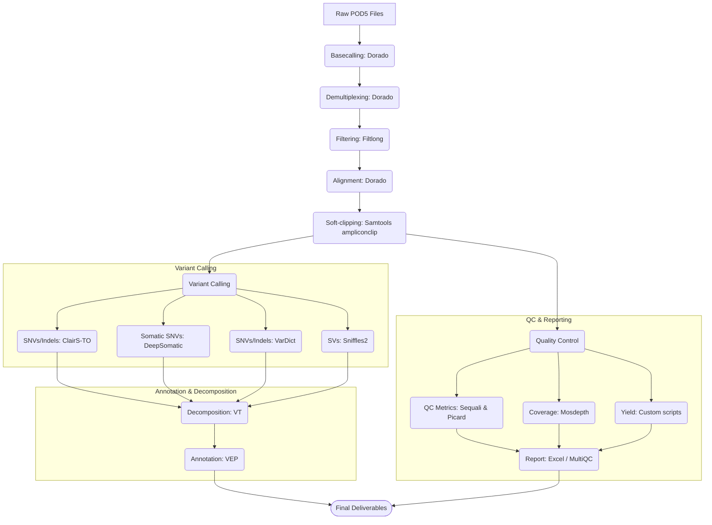

# Pipeline Overview

The `neville_mx_amplicon` pipeline processes raw Nanopore sequencing outputs (POD5/BAM) through a series of filtering, alignment, variant calling, and quality control steps.

Below is an overview of the analysis workflow:

## Detailed Workflow Steps

1. **Basecalling & Demultiplexing**: Basecalls raw signal (POD5) data using *Dorado*, with optional custom models and demultiplexing barcoded samples.
2. **Quality Filtering**: Uses *Filtlong* to discard reads with insufficient quality scores or reads that are too long/short (preventing chimeric/truncated amplicon artifacts).
3. **Alignment & Primer Clipping**: Aligns filtered reads to the reference genome using *Dorado* and performs soft-clipping of primer sequences with *Samtools ampliconclip*.
4. **Variant Calling**: Performs variant discovery via *ClairS-TO* (tumor-only/germline), *DeepSomatic* (tumor-only/somatic), *VarDict* (in amplicon mode), and *Sniffles2* (structural variants).
5. **Variant Annotation**: Normalizes multi-allelic and block variants with *VT*, and annotates consequences using *VEP*.
6. **QC, Coverage & Yield Assessment**:
    - Generates read metrics with *Sequali*.
    - Approximates per-amplicon read counts using *Mosdepth* coverage.
    - Estimates off-target rate with *Picard*.
    - Calculates pool-wise and amplicon-wise yield balances using a custom script.
7. **Final Reporting**: Merges caller results and quality statistics into a single `.xlsx` spreadsheet and compiles QC metrics into an interactive MultiQC page.
